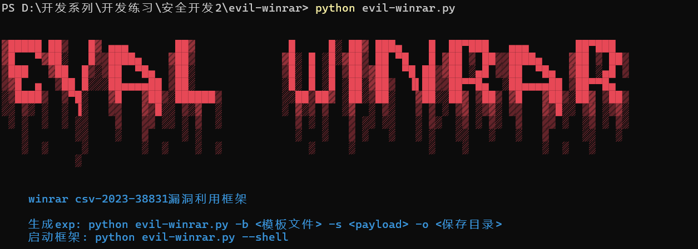
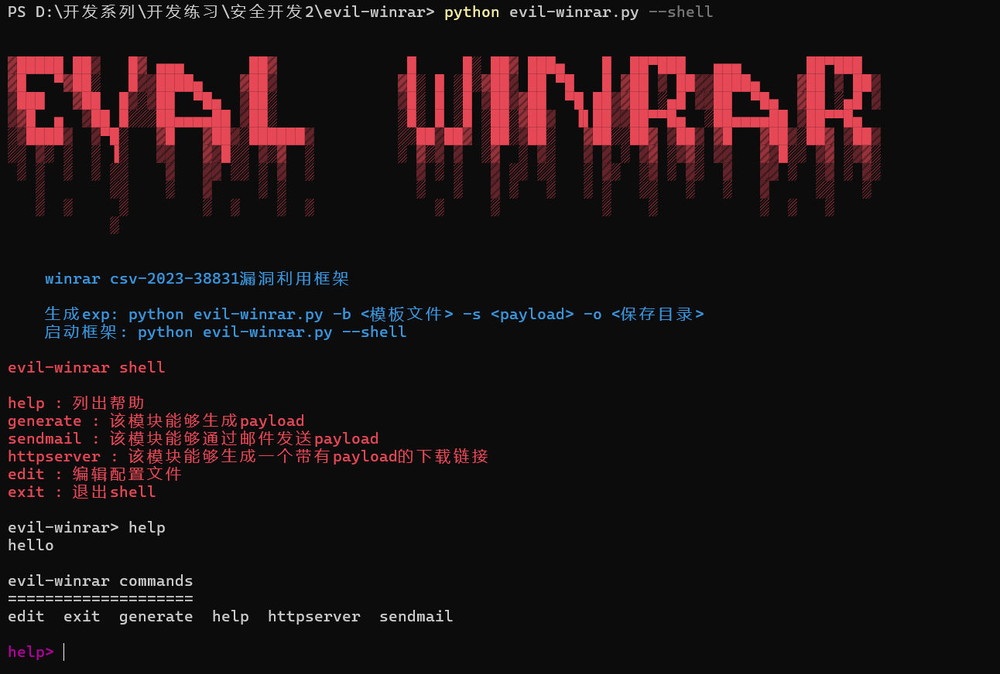

# evil-winrar

## 介绍

evil-winrar是winrar csv-2023-38831漏洞利用和社会工程学攻击框架,支持exp生成,邮件发送和下载链接生成

## 下载

```
git clone https://github.com/youmulijiang/evil-winrar.git
cd evil-winrar
python evil-winrar.py
```

## 使用截图




## 作者介绍

作者是一个安全开发成员,如果喜欢该项目,请点击右上角的start⭐
梨酱最喜欢⭐⭐啦 ヾ(≧▽≦*)o
